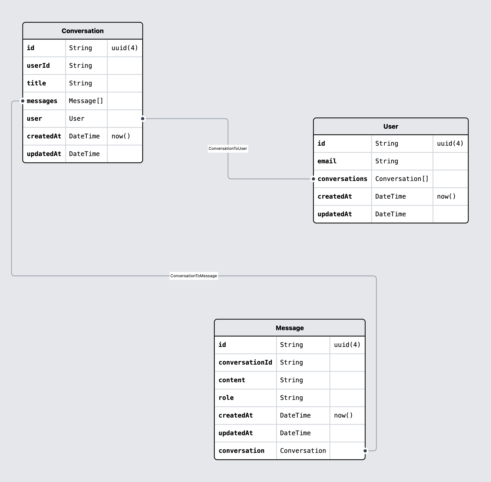
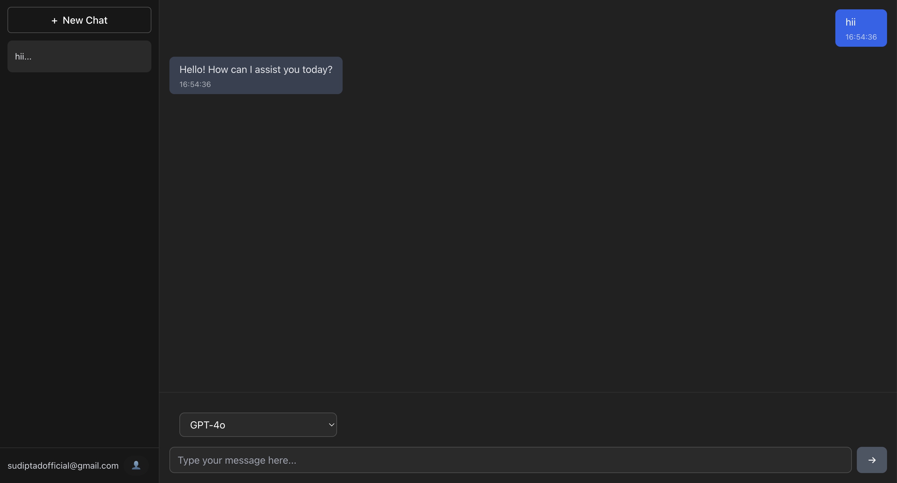

# 🤖 ChatAI

> A lightning-fast, cost-effective AI chat platform with multiple models and intelligent conversation management. 

## Database Model


## 🚀 Key Features

- **Multiple AI Models**: Choose from GPT-4o, Deepseek Chat, Qwen Coder, Google Gemini, and more
- **Smart Conversations**: Persistent chat history with intelligent conversation management
- **Lightning Fast**: Optimized for speed with real-time streaming responses
- **Beautiful Interface**: Clean, modern design built with React and TypeScript
- **Secure Authentication**: OTP-based login system for enhanced security

## 🛠️ Tech Stack

### Frontend

- **React 18** with TypeScript
- **Tailwind CSS** for styling
- **Vite** for blazing-fast development

### Backend

- **Node.js** with Express
- **TypeScript** for type safety
- **Prisma ORM** with PostgreSQL
- **JWT Authentication**
- **OpenRouter API** for AI model access

## 🎯 Core Functionality

### Intelligent Chat Management

- Create and manage multiple conversations
- Automatic conversation titling based on first message
- Delete conversations with proper data cleanup
- Seamless conversation switching

### Multi-Model Support

- **GPT-4o**: OpenAI's flagship model
- **Deepseek Chat**: Advanced reasoning capabilities
- **Qwen Coder**: Specialized for coding tasks
- **Google Gemini 2.0**: Latest Google AI technology
- **GPT-OSS**: Cost-effective alternative


## 📦 Getting Started

### Prerequisites

- Node.js 18+
- PostgreSQL database
- OpenRouter API key

### Installation

1. **Clone the repository**

   ```bash
   git clone https://github.com/sdass1918/ChatAI-Project.git
   cd ChatAI-Project
   ```

2. **Setup Backend**

   ```bash
   cd Backend
   npm install
   # Configure your environment variables
   npx prisma migrate dev
   npm run dev
   ```

3. **Setup Frontend**

   ```bash
   cd frontend
   npm install
   # Configure your environment variables
   npm run dev
   ```

4. **Environment Variables**

   ```env
   # Backend (.env)
   DATABASE_URL="your_postgresql_url"
   JWT_SECRET="your_jwt_secret"
   OPENROUTER_API_KEY="your_openrouter_key"

   # Frontend (.env)
   VITE_BACKEND_URL="http://localhost:3000"
   ```

## 🎨 Screenshots



## 🔧 API Endpoints

### Authentication

- `POST /auth/initiate_signin` - Start OTP login process
- `POST /auth/signin` - Complete login with OTP

### Conversations

- `GET /ai/conversations` - List all conversations
- `POST /ai/conversations` - Create new conversation
- `GET /ai/conversations/:id` - Get conversation with messages
- `DELETE /ai/conversations/:id` - Delete conversation

### Chat

- `POST /ai/chat` - Send message and get AI response (streaming)

## 📱 Usage

1. **Sign In**: Enter your email to receive an OTP
2. **Verify**: Enter the OTP to access your dashboard
3. **New Chat**: Click "New Chat" to start a conversation
4. **Choose Model**: Select from available AI models
5. **Chat**: Send messages and receive real-time AI responses
6. **Manage**: Switch between conversations or delete old ones

